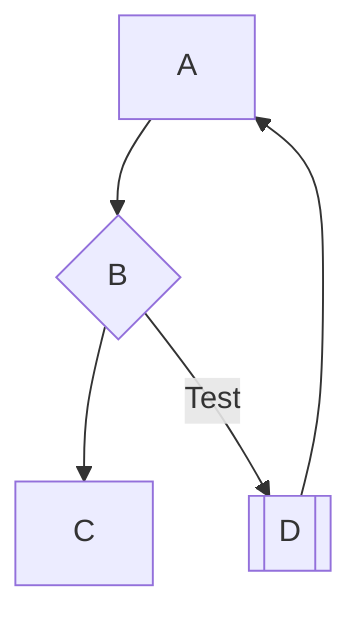
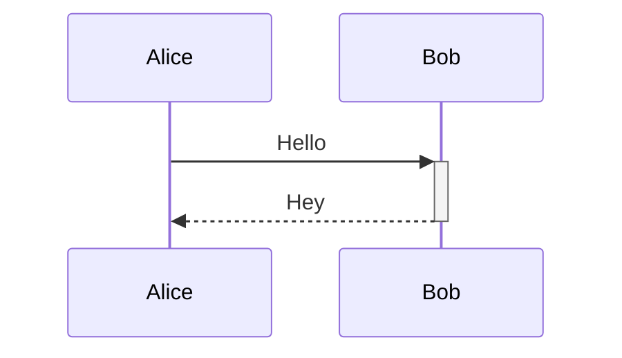
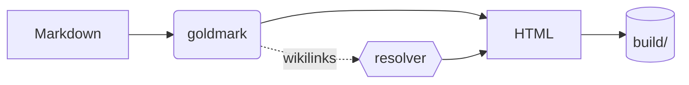
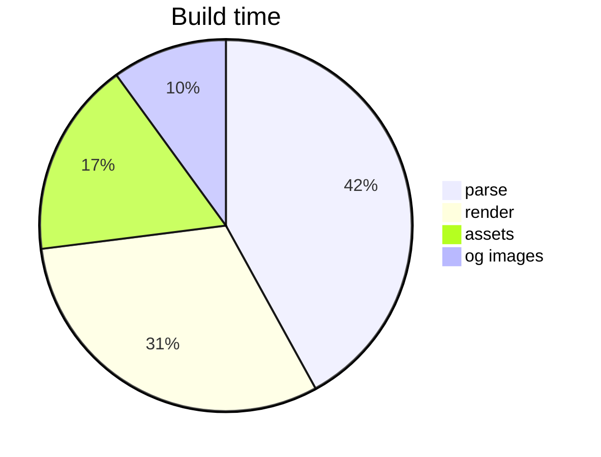
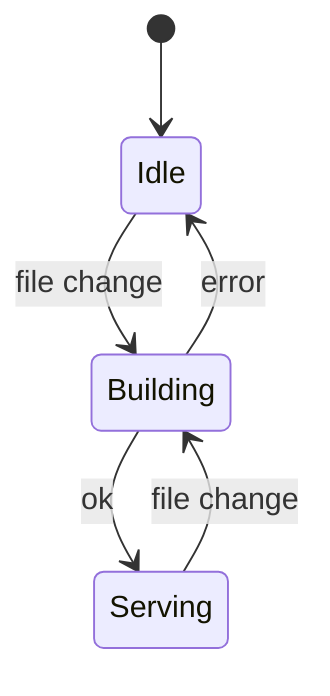
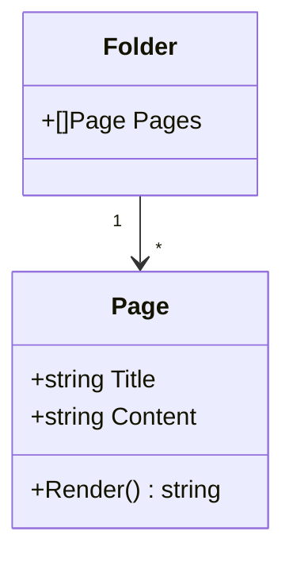
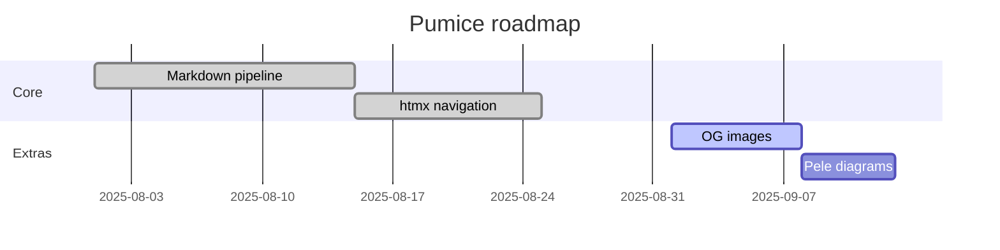

# Mermaid Chart Example

```mermaid
graph TD
    A --> B{B}
    B --> C[C]
    B -->|Test| D[[D]]
    D --> A
```

```mermaid
sequenceDiagram
    participant A as Alice
    participant B as Bob
    A->>+B: Hello
    B-->>-A: Hey
```

```mermaid
flowchart LR
    md[Markdown] --> gm(goldmark)
    gm --> html[HTML]
    gm -.->|wikilinks| res{{resolver}}
    res --> html
    html --> site[(build/)]
```

```mermaid
pie title Build time
    "parse" : 42
    "render" : 31
    "assets" : 17
    "og images" : 10
```

```mermaid
stateDiagram-v2
    [*] --> Idle
    Idle --> Building: file change
    Building --> Serving: ok
    Building --> Idle: error
    Serving --> Building: file change
```

```mermaid
classDiagram
    class Page {
        +string Title
        +string Content
        +Render() string
    }
    class Folder {
        +[]Page Pages
    }
    Folder "1" --> "*" Page
```

```mermaid
gantt
    title Pumice roadmap
    dateFormat YYYY-MM-DD
    section Core
    Markdown pipeline :done, 2025-08-01, 14d
    htmx navigation   :done, 2025-08-15, 10d
    section Extras
    OG images         :active, 2025-09-01, 7d
    Pele diagrams     :2025-09-08, 5d
```
